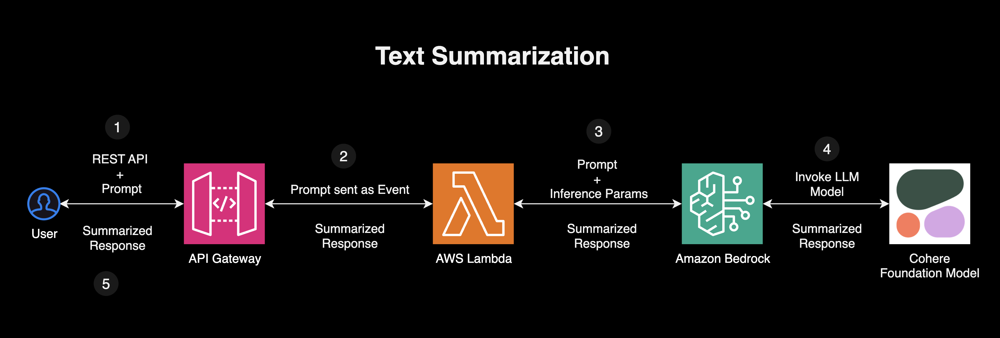

# Amazon Bedrock Text Summarization Use Case 

## Overview

This AWS-based text summarization pipeline enables users to generate AI-powered summaries using Amazon Bedrock and return concise text outputs. The system is triggered via an API Gateway, which invokes an AWS Lambda function. The Lambda function processes the user’s text input, calls Amazon Bedrock's Cohere foundation model to generate a summary, and returns the result to the user.




## **How It Works (Step-by-Step)**  

### **1. User Submits a Request**  
- A user sends a **POST request** via an **API Gateway REST API**, including a **text input** that they want to summarize.  
- Example request body:  
  ```json
  {
      "prompt": "The quick brown fox jumps over the lazy dog. The dog, unbothered, remains still. Summarize this text."
  }
  ```

### **2. API Gateway Forwards the Request to AWS Lambda**  
- API Gateway acts as an entry point and forwards the request to an **AWS Lambda function**.  
- The Lambda function is triggered with the event containing the **user's text input**.  

### **3. Lambda Calls Amazon Bedrock for Text Summarization**  
- The Lambda function extracts the **text input** from the request:  
  ```python
  request_body = json.loads(event['body'])
  user_text = request_body['prompt']
  ```
- It then **invokes Amazon Bedrock** to generate a summary using a **Cohere foundation model**:  
  ```python
  response = bedrock.invoke_model(
      modelId="cohere.command-light-text-v14",
      body=json.dumps({
          "prompt": f"Summarize the following text. Be concise and to the point. {user_text}",
          "max_tokens": 100
      })
  )
  ```
  
### **4. Amazon Bedrock Processes the Request and Returns a Summary**  
- Amazon Bedrock sends the request to **Cohere's model**, which generates a summarized response.  
- The summarized text is sent back to the Lambda function.  

### **5. Lambda Returns the Summarized Text to the User**  
- The Lambda function formats the summarized output and returns it as a response:  
  ```json
  {
      "summary": "The fox jumps over the dog, which remains still."
  }
  ```
- API Gateway relays this response back to the user.  


### Testing the API

Using curl
```sh
curl -X POST https://0cb5z82wq0.execute-api.us-east-1.amazonaws.com/dev/summarize \
  -H "Content-Type: application/json" \
  -d '{"prompt": "<your text goes here>"}'
```

Using httpie (Verbose Mode)

```sh
http -v POST https://0cb5z82wq0.execute-api.us-east-1.amazonaws.com/dev/summarize \
prompt=Deep research is built for people who do intensive knowledge work in areas like finance, science, policy, and engineering and need thorough, precise, and reliable research. It can be equally useful for discerning shoppers looking for hyper-personalized recommendations on purchases that typically require careful research, like cars, appliances, and furniture. Every output is fully documented, with clear citations and a summary of its thinking, making it easy to reference and verify the information. It is particularly effective at finding niche, non-intuitive information that would require browsing numerous websites. Deep research frees up valuable time by allowing you to offload and expedite complex, time-intensive web research with just one query."
```

Response from the API Gateway
```sh
POST /dev/summarize HTTP/1.1
Accept: application/json, */*;q=0.5
Accept-Encoding: gzip, deflate
Connection: keep-alive
Content-Length: 771
Content-Type: application/json
Host: 0cb5z82wq0.execute-api.us-east-1.amazonaws.com
User-Agent: HTTPie/3.2.4

{
    "prompt": "Deep research is built for people who do intensive knowledge work in areas like finance, science, policy, and engineering and need thorough, precise, and reliable research. It can be equally useful for discerning shoppers looking for hyper-personalized recommendations on purchases that typically require careful research, like cars, appliances, and furniture. Every output is fully documented, with clear citations and a summary of its thinking, making it easy to reference and verify the information. It is particularly effective at finding niche, non-intuitive information that would require browsing numerous websites. Deep research frees up valuable time by allowing you to offload and expedite complex, time-intensive web research with just one query."
}


HTTP/1.1 200 OK
Connection: keep-alive
Content-Length: 556
Content-Type: application/json
Date: Sun, 16 Feb 2025 00:01:43 GMT
X-Amzn-Trace-Id: Root=1-67b12ae5-5b9e2f600ecec302468e1dc6;Parent=15b6e4e5a54abb91;Sampled=0;Lineage=1:ba6bf4ee:0
x-amz-apigw-id: GDOj5FqwoAMEAIQ=
x-amzn-RequestId: 289d1334-4ec7-4995-aa3b-8c5ce227f97b

{
    "summary": "DeepResearch is tailored to those requiring in-depth knowledge for specific fields, such as policy, engineering, science, and finance. This tool is ideal for all those seeking precise and reliable information and highly personalized recommendations for costly purchases that require research. The tool will save users time and money by allowing users to understand and obtain information from multiple sources with just one query."
}


```

## **Technologies Used**  
- **Amazon API Gateway** – Handles incoming API requests and routes them to Lambda.  
- **AWS Lambda** – Processes user inputs and invokes Amazon Bedrock.  
- **Amazon Bedrock** – Provides AI-powered summarization via **Cohere's model**.   


## Running the code

Initialize Terraform
```sh
terraform init 
```

Plan the deployment
```sh
terraform plan
```

Apply the deployment
```sh
terraform apply -auto-approve
```

Destroy the infrastructure

```sh
terraform destroy -auto-approve
```


